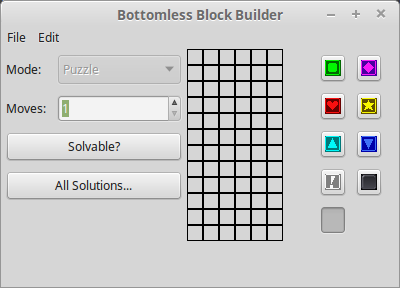

# bottomless-block-builder
Level editor for bottomless-block-barrage

# Installation from Source manually on Linux (Debian based distros)
From the root directory of where you have the source code.
 1. Ensure you have a C++ compiler (sudo apt-get install build-essential)
 2. Ensure you have CMake installed (sudo apt-get install cmake)
 3. Install dependency wxWidgets 3.0 (sudo apt-get install libwxgtk3.0-dev)
 4. Create a build directory (mkdir build && cd build)
 5. Generate a Makefile via cmake (cmake ..)
 6. Build the program (make)
 7. Install the program (sudo make install)
 8. Run ldconfig (sudo ldconfig)

